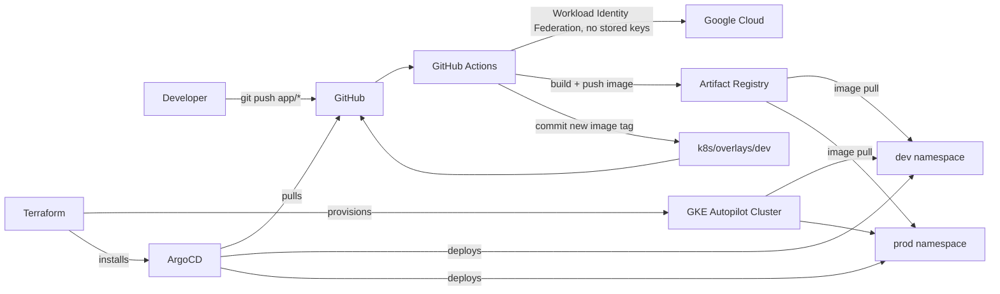

# gitops-gke-platform


A small Flask app deployed to **Google Kubernetes Engine (Autopilot)** across two isolated
environments, entirely through **GitOps** — Terraform provisions the infrastructure, ArgoCD
continuously reconciles the cluster against this repository, and GitHub Actions closes the loop
by building images and updating manifests automatically. No manual `kubectl apply` is used to
deploy the application in normal operation.

## What this demonstrates

- Infrastructure as Code end to end — a GKE Autopilot cluster, and ArgoCD's own installation,
  both provisioned by a single `terraform apply`.
- A GitOps deployment model (pull-based, not push-based) using ArgoCD, with an
  **App of Apps** pattern so even ArgoCD's own `Application` resources are git-managed.
- Environment isolation via **Kustomize** (`base` + `dev`/`prod` overlays) with independently
  controllable image tags per environment — dev auto-deploys, prod is promoted deliberately.
- Keyless CI authentication to GCP via **Workload Identity Federation** — no service account
  keys stored anywhere, ever.
- A CI/CD pipeline where a single `git push` builds an image, tags it with the commit SHA,
  and triggers an automatic dev deployment — with prod promotion as an explicit, auditable
  one-line change.

## Architecture



Promotion to prod is deliberately **not** automatic: it's a one-line change to
`k8s/overlays/prod/kustomization.yaml` (copying dev's proven image tag), committed and pushed —
a small, explicit, reviewable action rather than an implicit side effect of merging code.

## Stack

| Layer | Tool |
|---|---|
| Cloud | Google Cloud Platform (GKE Autopilot) |
| Infrastructure as Code | Terraform (cluster + ArgoCD install) |
| GitOps | ArgoCD (App of Apps pattern) |
| Manifest management | Kustomize (base + dev/prod overlays) |
| CI/CD | GitHub Actions, authenticated via Workload Identity Federation |
| App | Python (Flask), containerized |
| Registry | Google Artifact Registry |

## Repository layout

```
app/         Flask application source + Dockerfile
terraform/   GKE Autopilot cluster + ArgoCD Helm install
k8s/         Kustomize base + dev/prod overlays
argocd/      ArgoCD Application manifests (managed by the root app)
bootstrap/   The one manually-applied root "App of Apps"
.github/     CI workflow (build, push, auto-deploy to dev)
```

## Notable engineering decisions

- **GKE Autopilot over Standard mode** — no idle node cost while the cluster isn't actively
  serving traffic, at the cost of some lower-level node control; a deliberate tradeoff for a
  cost-conscious learning/demo environment.
- **Workload Identity Federation over a service account key** — since this repository is
  public, no long-lived GCP credential is ever stored in GitHub; CI authenticates using
  short-lived tokens tied to a specific repository claim.
- **Per-environment image tags via Kustomize's `images` field** — dev and prod can run
  different versions of the same app independently, without duplicating manifests.
- **App of Apps** — ArgoCD's own `Application` objects are themselves managed via GitOps,
  rather than requiring manual `kubectl apply` after every cluster rebuild.
